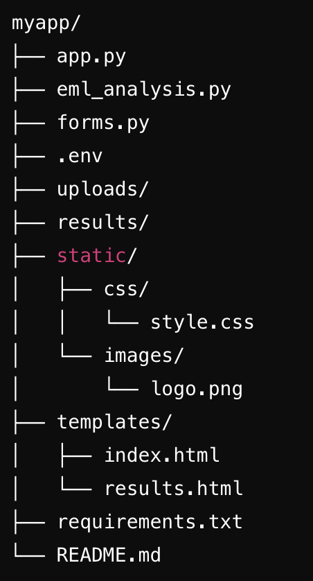
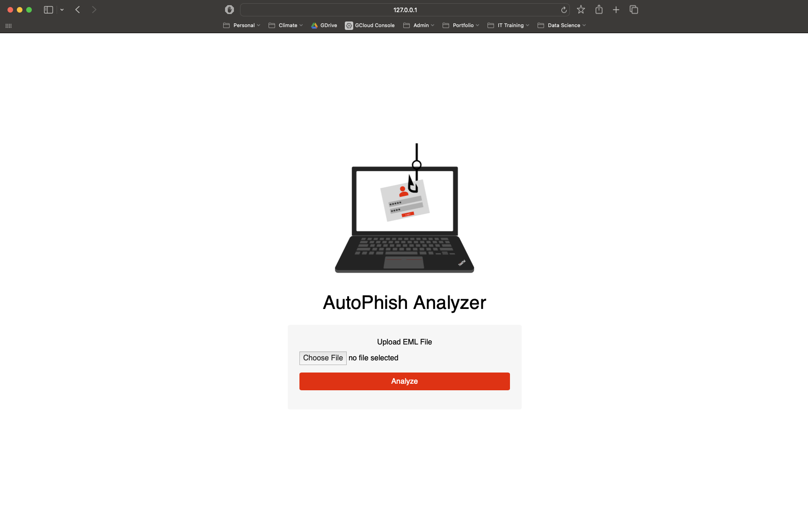
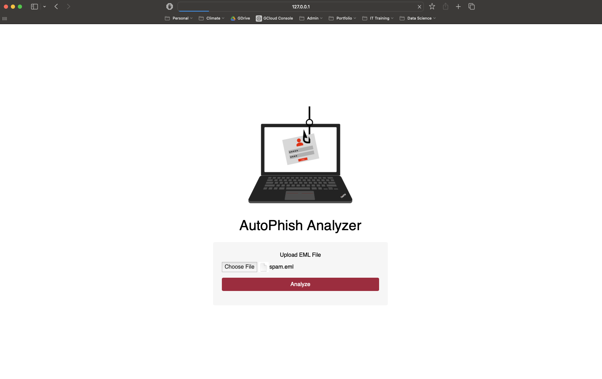
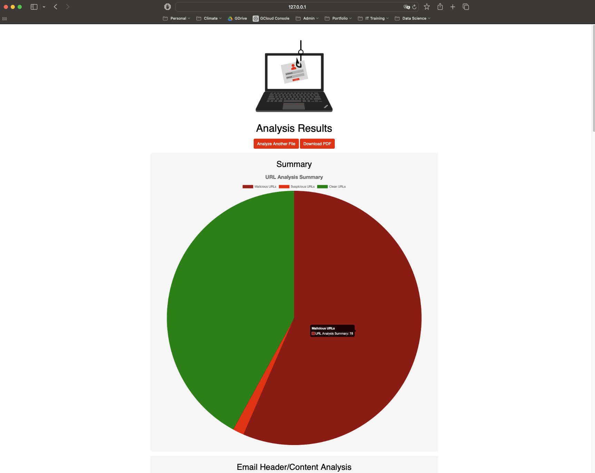

# AutoPhish Analyzer

## Description

The **AutoPhish Analyzer** is a Python-based application designed to assist cybersecurity analysts in analyzing phishing emails efficiently. By automating the extraction of key information, such as email headers, URLs, and attachments, and checking these elements against security databases like VirusTotal, this app significantly reduces the time required to assess potentially malicious emails. This tool enhances the security posture of an organization by enabling faster identification and response to phishing threats, ultimately helping to mitigate the risk of successful phishing attacks.

<div style="text-align: center;">
  <strong>Please Note: This is an ongoing Project and will be modified and expanded soon</strong>
</div>

## App Overview

The **AutoPhish Analyzer** consists of several Python scripts working together:

- **app.py**: The main Flask application that handles the web interface, file uploads, and triggering the email analysis process.
- **eml_analysis.py**: A script responsible for analyzing the content of the uploaded EML (email) files, extracting relevant metadata, URLs, and attachments, and checking them against VirusTotal.
- **forms.py**: Contains the form class used in the web interface to handle EML file uploads.
- **templates/index.html**: The HTML template for the app's main page where users upload their EML files.
- **templates/results.html**: The HTML template for displaying the analysis results.
- **static/**: Contains CSS for styling and images used in the app.

<div style="text-align: center;">
  
</div>

## Key Features

- **Email Header Analysis**: Extracts and displays key email header information such as sender, recipients, subject, and authentication results.
- **URL Analysis**: Checks URLs found in the email against VirusTotal and categorizes them as malicious, suspicious, or clean.
- **Attachment Analysis**: Extracts attachments, calculates hashes, and checks them against VirusTotal for malicious content.
- **PDF Report Generation**: Generates a detailed PDF report of the analysis, which can be downloaded by the user.

## Process Walkthrough

To use the AutoPhish Analyzer, follow these steps:

1. Upload the EML File: Navigate to the main page of the web application. You will see a file upload form labeled "Upload EML File." Click the "Choose File" button to select the EML file you wish to analyze.


2. Analyze the Email: After selecting the file, click the "Analyze" button. The app will process the file, extracting information such as email headers, URLs, and attachments.


3. View the Results: Once the analysis is complete, the results page will display a summary of the findings, including any malicious or suspicious URLs and attachment checks. The page will also provide a link to download a detailed PDF report.


## Installation and Setup

### Prerequisites

Python 3.8+: Ensure you have Python installed. You can download it from python.org.

To set up and run the AutoPhish Analyzer on your local machine or a different host:

1. Clone the Repository:

```bash
git clone https://github.com/FUenal/autophish-analyzer.git
cd autophish-analyzer
```

2. Create a Virtual Environment (optional but recommended):

```bash
python3 -m venv venv
source venv/bin/activate  # On Windows use `venv\Scripts\activate`
```

3. Install the Required Python Modules:

```bash
pip install -r requirements.txt
```

4. Set Up Environment Variables:
Create a .env file in the root directory of the project and add your VirusTotal API key:

```makefile
VIRUSTOTAL_API_KEY=your_virustotal_api_key
```

5. Run the Flask App:

```bash
python app.py
```

The application will be accessible at <http://127.0.0.1:5000/> in your web browser.

## Environment

- Python Version: The app is built using **Python 3.8** or later.

- Key Modules:
  - `Flask`: For handling web requests and serving the web interface.
  - `Flask-WTF`: For form handling in Flask.
  - `Werkzeug`: For secure filename handling.
  - `ReportLab`: For generating PDF reports.
  - `BeautifulSoup4`: For parsing HTML content.
  - `requests`: For making HTTP requests to VirusTotal.
  - `python-dotenv`: For loading environment variables from a .env file.

These dependencies are listed in the requirements.txt file, which can be used to install all necessary packages.

## Contributing

You are welcome to fork the repository and submit a pull request for any improvements or bug fixes.
